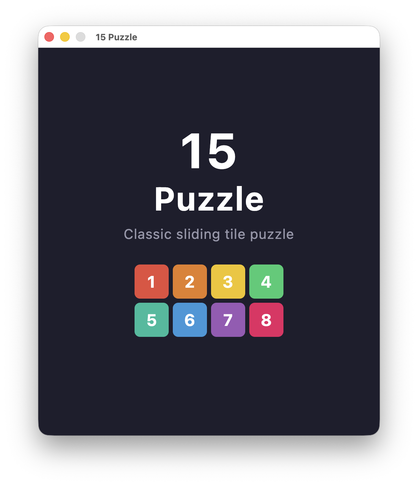
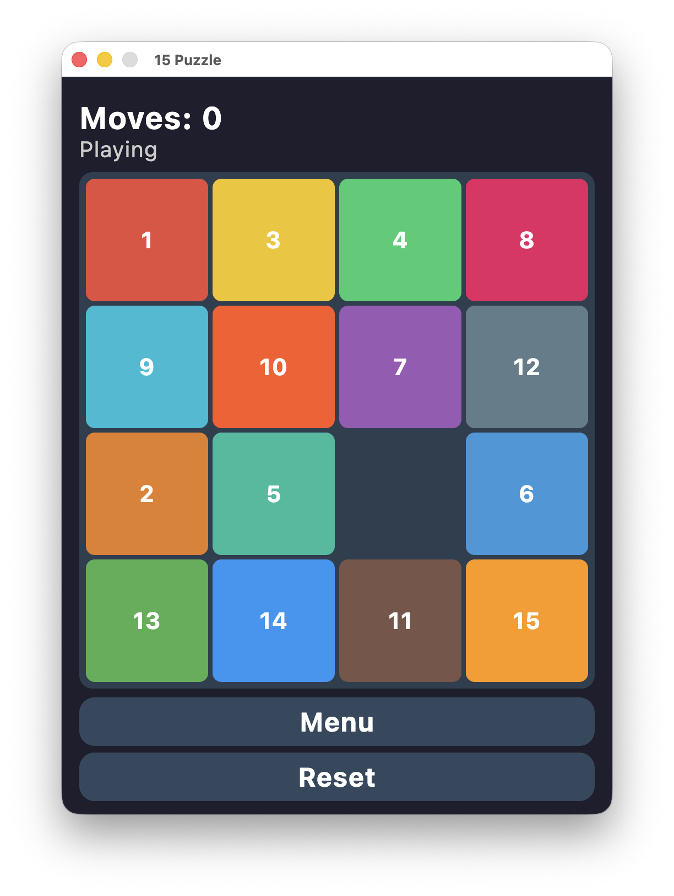
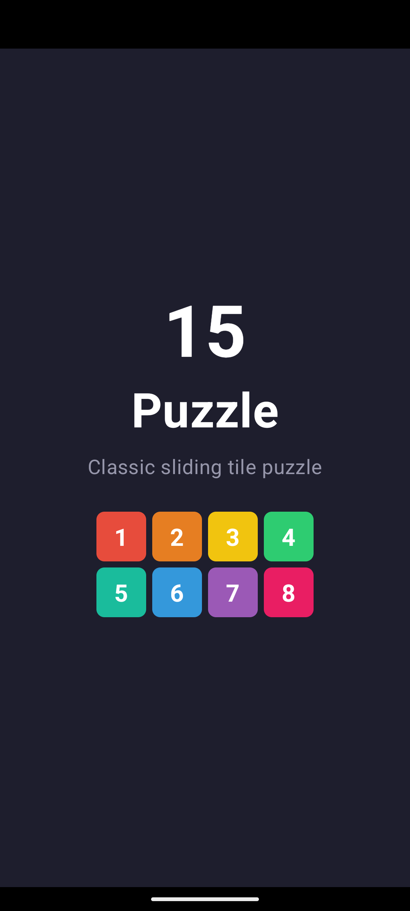
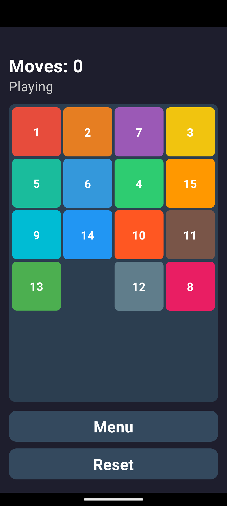
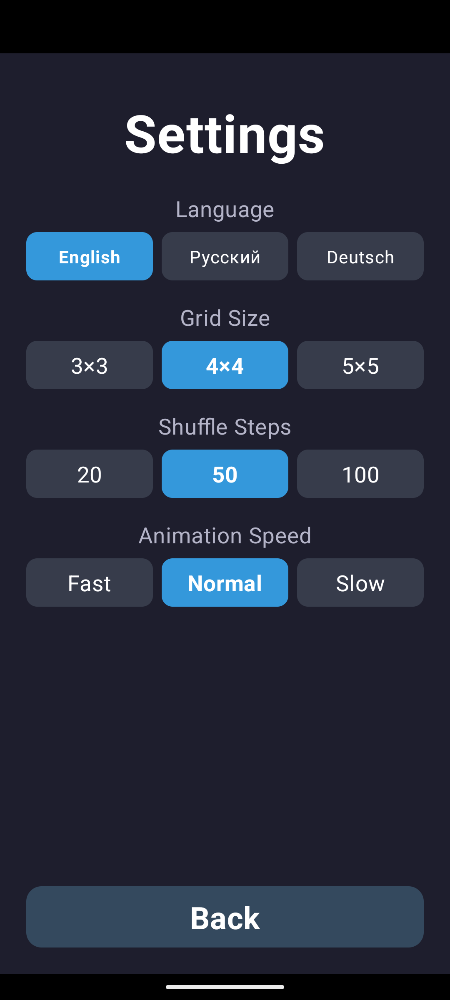

# 15 Puzzle

Classic sliding tile puzzle game built with Kotlin. Runs on Android and Desktop.

## Screenshots

### All Apps & GitHub


### Desktop

| Splash Screen | Game | 
|:---:|:---:|
|  |  |

### Android

| Splash Screen | Game | Settings |
|:---:|:---:|:---:|
|  |  |  |

## Features

- Splash screen with tile animation
- Main menu (Play / Settings / Quit)
- Sliding puzzle on 3×3, 4×4, 5×5 grid
- Tile movement animation
- Settings: grid size, shuffle difficulty, animation speed, language
- Localization: English, Русский, Deutsch

## Project Structure

```
├── core/           # Pure game logic (no UI dependencies)
│   ├── src/main/kotlin/com/game/puzzle/
│   │   ├── GameController.kt
│   │   ├── model/        # GameState, Tile, MoveResult
│   │   └── service/      # PuzzleService, SaveService
│   └── src/test/kotlin/  # Unit tests (6 tests)
├── desktop/        # Swing-based desktop client
│   └── src/main/kotlin/.../DesktopLauncher.kt
├── android/        # Canvas-based Android client
│   └── src/main/kotlin/.../AndroidLauncher.kt
└── build.gradle.kts
```

## Requirements

- JDK 17+
- Android SDK (for Android build)
- Gradle 8.5+

## Build & Run

**Tests:**
```bash
JAVA_HOME=/path/to/jdk17 ./gradlew core:test
```

**Desktop:**
```bash
JAVA_HOME=/path/to/jdk17 ./gradlew desktop:run
```

**Android:**
```bash
JAVA_HOME=/path/to/jdk17 ./gradlew android:installDebug
```

## Architecture

- **core** — Pure Kotlin logic: puzzle generation, shuffling, move validation, win detection. Fully testable on JVM, no UI dependencies.
- **desktop** — Java Swing rendering with custom-painted tiles, buttons, and animated splash screen.
- **android** — Android Canvas/SurfaceView rendering with touch input and animated splash screen.

Settings (grid size, shuffle steps, animation speed, language) are shared between platforms via `AppSettings` (Desktop) and SharedPreferences (Android).

## License

MIT
